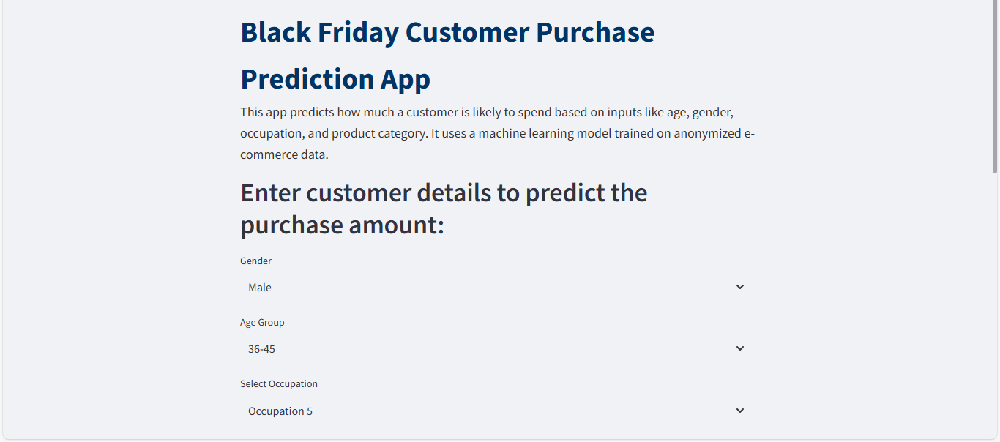
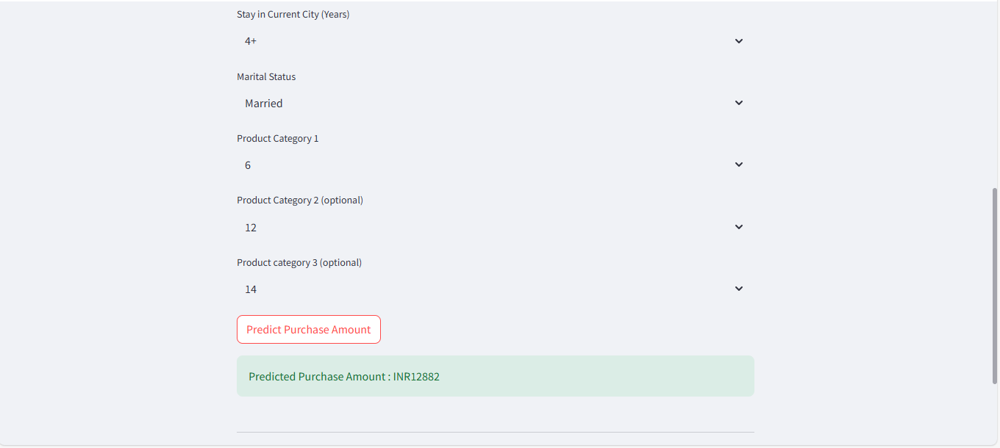

# Black-Friday-Purchase-Prediction

This project predicts customer **purchase amounts** dusing  Black Friday Sale using a **Random Forest Regressor**. The dataset is from [Kaggle](https://www.kaggle.com/datasets/cerolacia/black-friday-sales-prediction) and has been anonymized for privacy.
---
## Problem Statement

To build a machine learning model that can predict how much a customer will spend based on features like gender, age group, city category, and purchase history.
---
## Tech Stack Used
- **Python**
- **pandas, NumPy, Seaborn, matplotlib** - EDA and visualization
- **scikit-learn** - Data preprocessing and modeling (Random Forest)
- **Streamlit** - Model deployement
- **pickle** - Saving and loading models
---
## Approach
1. **Data Cleaning & Exploration**
   - Handled missing values
   - Encoded categorical variables (e.g., Gender, City_Category)
   - Visualized trends in purchase behavior.
2. **Model Building**
   - Used **Random Forest Regressor**
   - Achieved ~65% accuracy (R^2 Score)
   - Due to hardware limitations, couldn't try **XGBoost**, which is on the improvement list
3. **Deployment**
   - Deployed a simple interface using **Streamlit** for predictions

---
## Key learnings
- Importance of feature engineering
- Handling imbalanced dataset
- Using pickle and Streamlit for real-world deployement
---
## Limitations
- XGBoost could not be implemented due to hardware constraints
- Feature selection could be optimized further
  ---
## App Screenshots
Here are the screenshot of the working app predicting the purchase amount:

